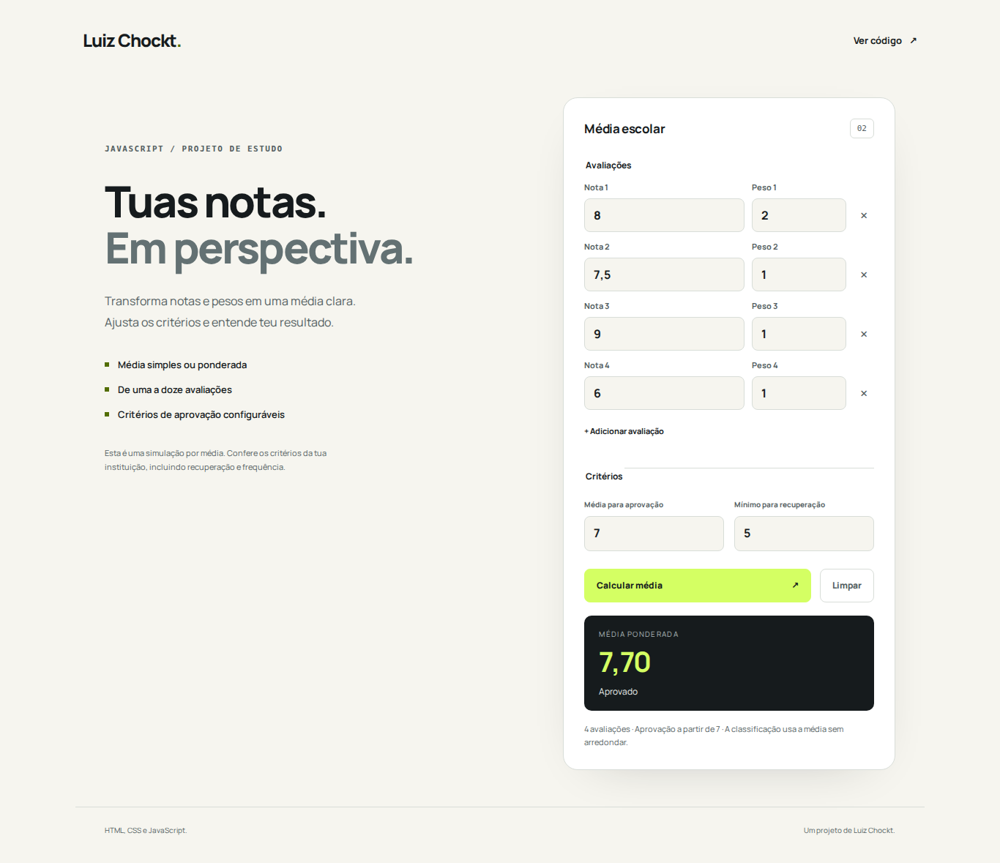

# Calculadora de Média Escolar

Uma ferramenta web de estudo para calcular médias simples ou ponderadas, com notas, pesos e critérios de aprovação configuráveis.

O projeto nasceu em 2023, no primeiro semestre de Análise e Desenvolvimento de Sistemas. Esta versão substitui a sequência de `prompt` e mensagens no console por um formulário que permite conferir entradas e resultados na própria página.



## O que faz

- Aceita de uma a doze avaliações, com notas entre 0 e 10.
- Calcula média simples quando todos os pesos são iguais ou ponderada quando diferem.
- Aceita decimais com ponto ou vírgula e valida campos vazios, notas fora do intervalo e pesos não positivos.
- Permite configurar as médias mínimas de aprovação e recuperação.
- Mostra a média e a classificação em texto; o resultado não depende apenas de cor.
- Usa labels associados aos campos, foco visível e temas claro e escuro.

## Fórmula e critérios

```text
média = soma(nota × peso) / soma(pesos)
```

Exemplo: notas **8** e **5**, com pesos **2** e **1**, geram média **7**.

Os critérios iniciais são: aprovação a partir de 7; recuperação a partir de 5 e abaixo de 7; abaixo de 5, resultado abaixo da média mínima. Esses valores podem ser alterados no formulário. A classificação usa o valor sem arredondar; a exibição usa até quatro casas decimais.

## Executar

```bash
git clone https://github.com/LuizChockt/Media-Escolar-Calc.git
cd Media-Escolar-Calc
python -m http.server 8000
```

Abre **http://localhost:8000**. É necessário servir por HTTP porque a aplicação usa módulos JavaScript. Também é possível usar Live Server.

## Testar

```bash
# Node.js 22 ou superior; sem dependências npm
npm test
```

Os testes verificam médias simples e ponderadas, decimais, limites de classificação, critérios alterados e entradas inválidas. O workflow incluído executa os testes em pushes e pull requests.

## Organização

- `index.html`: estrutura e formulário.
- `styles.css`: interface responsiva e temas.
- `src/grades.mjs`: validação e cálculo, sem dependência do DOM.
- `src/app.mjs`: campos dinâmicos, eventos e exibição.
- `tests/grades.test.mjs`: testes de comportamento.

## Limites

Esta ferramenta simula regras baseadas na média. Não considera frequência, substituição de notas, arredondamentos específicos da instituição ou cálculo de prova final. As notas não são persistidas nem transmitidas para um servidor.

## Licença

[Apache License 2.0](./LICENSE), preservada do projeto original. A fonte Manrope segue a licença em [assets/OFL-Manrope.txt](./assets/OFL-Manrope.txt).
